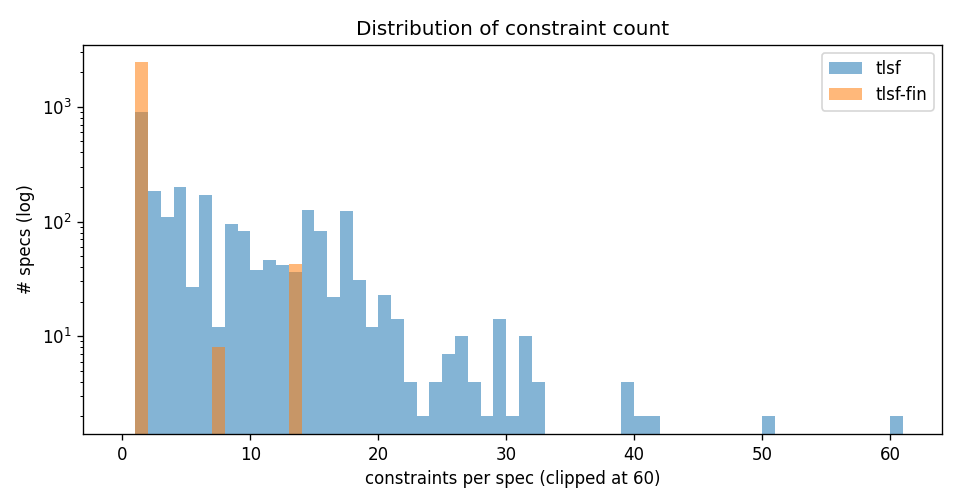
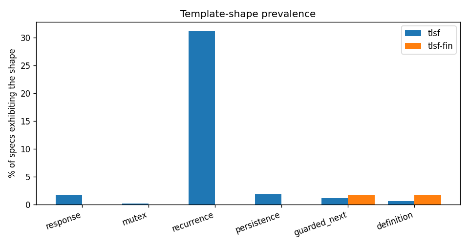
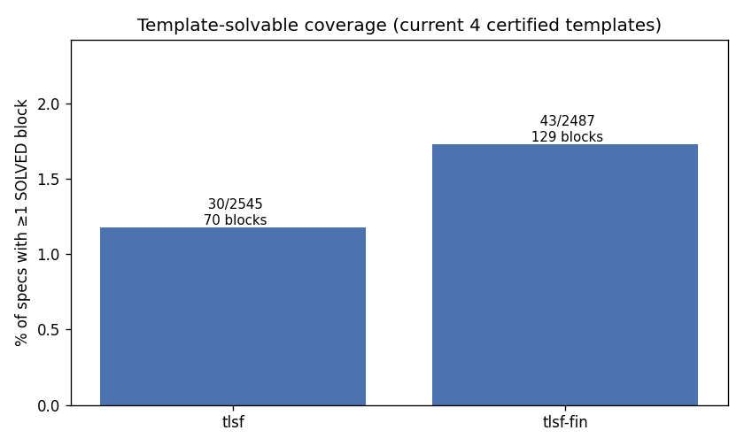
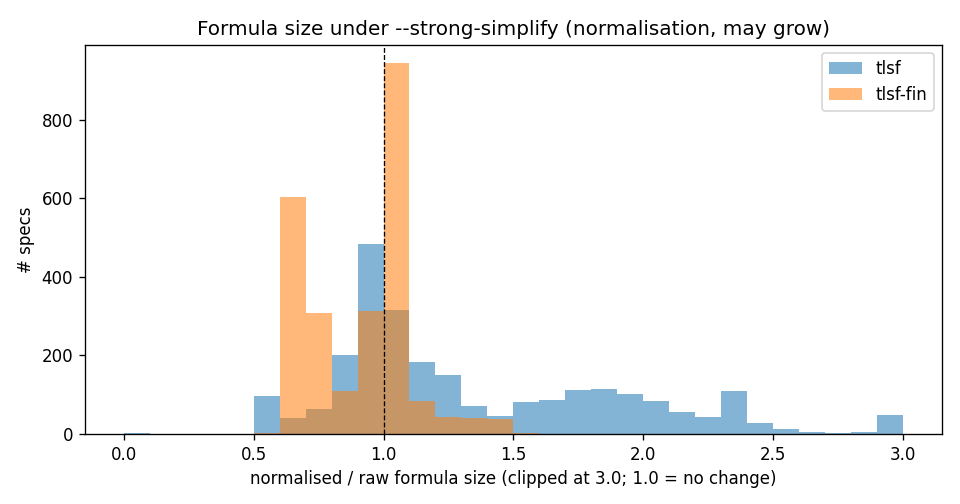
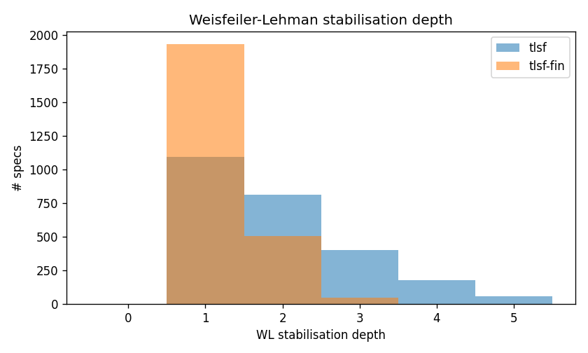

# SYNTCOMP form / template-shape statistics

Aggregate structural statistics of the [SYNTCOMP](https://github.com/SYNTCOMP/benchmarks)
benchmark corpus, computed with `tlsfbenchgraph` and summarised here. Two sets:

- **`tlsf`** — the real-time / infinite-word benchmarks (2545 specs).
- **`tlsf-fin`** — the finite-word (LTLf) benchmarks (2487 specs).

Every spec in both sets parses, expands, and is analysed (0 failures). All
numbers below come from the synthesis-graph layer (`tlsfgraph` cover +
recognizers, `tlsftemplates` certification, `tlsfwl` WL refinement); they are
*syntactic* — a constraint is counted under a shape only if it matches that
shape's exact pattern, so the per-shape counts are **lower bounds** on how many
specs are "really" of that form.

Regenerate everything (plots + the tables below) with:

```sh
ninja -C build                                   # build tlsfbenchgraph
python3 scripts/benchgraph_plots.py \
    --benchgraph build/tlsfbenchgraph --out docs/benchgraph --wl 6 \
    /path/to/benchmarks/tlsf:tlsf \
    /path/to/benchmarks/tlsf-fin:tlsf-fin
```

(The script needs `matplotlib`; it runs `tlsfbenchgraph` itself, writes the
PNGs under `docs/benchgraph/`, and prints the markdown tables to stdout. The
per-spec TSVs are written to a temp dir and discarded.)

---

## Corpus overview

| corpus | specs | parsed | constraints (med/mean/max) | inputs (med) | outputs (med) |
|---|--:|--:|---|--:|--:|
| `tlsf` | 2545 | 2545 | 4 / 13.2 / 576 | 8 | 3 |
| `tlsf-fin` | 2487 | 2487 | 1 / 1.2 / 13 | 12 | 10 |



The two sets are shaped very differently. `tlsf` specs have a small median
size (4 constraints) but a long heavy tail (up to 576 — the encoded
`sweap`/`box` families). `tlsf-fin` specs are almost all a **single** formula
(median 1, mean 1.2): they read like compiled/encoded sequential problems
rather than hand-written multi-clause reactive specs.

## Template-shape prevalence

| corpus | response | mutex | recurrence | persistence | guarded_next | definition |
|---|--:|--:|--:|--:|--:|--:|
| `tlsf` | 44 (114) | 4 (4) | 796 (1499) | 46 (54) | 30 (54) | 16 (16) |
| `tlsf-fin` | 0 (0) | 0 (0) | 0 (0) | 0 (0) | 43 (86) | 43 (43) |

_Cells: number of specs exhibiting the shape, and (total candidate count)._



- **`tlsf` is recurrence-dominated.** A `GF` recurrence appears in **796 / 2545
  (≈31 %)** specs — by far the most common recognised shape — with 1499 total
  recurrences. `response` (`G(r → F g)`), `persistence`, and
  `guarded-next` are present but scattered (≈1–2 % of specs each); explicit
  `mutex` is almost absent (4 specs) — grant-exclusivity is usually encoded
  differently than the literal `G !(a && b)` our recognizer matches.
- **`tlsf-fin` has a disjoint profile: zero** recurrence / response / mutex /
  persistence. The only recognised shapes are **guarded-next-assignment (43)**
  and **definition (43)** — consistent with finite-word problems being
  next-state / decoder oriented and `GF` being meaningless on finite traces.

## Safety / liveness and template-solvable coverage

| corpus | safety | liveness | solved blocks | certified | specs with a solved block | norm/raw size (med/mean) |
|---|--:|--:|--:|--:|--:|--:|
| `tlsf` | 23958 | 9555 | 70 | 4 | 30 | 1.13 / 1.39 |
| `tlsf-fin` | 686 | 2365 | 129 | 0 | 43 | 0.99 / 0.91 |

_safety/liveness are **per-constraint** totals (syntactic classification)._



- `tlsf` constraints are ~71 % syntactic-safety; `tlsf-fin` is the inverse
  (~77 % liveness — but since those specs are ≈1 constraint each, that just says
  most finite-word specs are a single liveness formula).
- **Template-solvable coverage is small and quantifies the headroom.** Only
  **30 / 2545** `tlsf` and **43 / 2487** `tlsf-fin` specs contain at least one
  block the current four certified templates (definition, round-robin,
  guarded-next, mutex) can fully *solve*. The point of the soundness ladder is
  that this number is trustworthy: everything else is honestly left residual
  for real synthesis. It is also the obvious place to grow the template library.

## Normalisation (formula size under `--strong-simplify`)



`--strong-simplify` is a *normal form*, not a size minimiser: it eliminates
`W`/`R` (which expand) and applies NNF. On `tlsf` it tends to **grow** formulas
(median 1.13×, mean 1.39×), driven by the `W`/`R`-heavy specs; on `tlsf-fin` it
is roughly neutral (median 0.99×). This is worth keeping in mind before using
it as a pre-pass — it normalises operator set and polarity, it does not shrink.

## Weisfeiler-Lehman stabilisation depth

| corpus | WL stabilisation depth (med/mean/max) |
|---|---|
| `tlsf` | 2 / 1.9 / 5 |
| `tlsf-fin` | 1 / 1.2 / 3 |



The synthesis graphs are structurally **shallow**: WL colour refinement reaches
a fixed point in a median of 2 rounds (`tlsf`) / 1 round (`tlsf-fin`), never
more than 5. So cheap, low-depth WL fingerprints already separate the
structurally distinct neighbourhoods — good news for clustering/retrieval
(`tlsfwl`): there is no need for deep refinement.

---

## Key takeaways

1. **The two corpora are structurally distinct.** Real-time `tlsf` is
   recurrence-heavy and multi-clause with a long size tail; finite-word
   `tlsf-fin` is single-formula, next-state/decoder oriented, with **no**
   recurrence/response/mutex at all.
2. **Recurrence is the dominant hand-written pattern** in `tlsf` (~31 % of
   specs); literal mutex is essentially never written out.
3. **The certified-template library currently solves a small slice** (≈1–2 % of
   specs have a fully solved block) — an honest, sound floor and a clear target
   for more templates.
4. **`--strong-simplify` normalises but can enlarge** (median ×1.13 on `tlsf`).
5. **Structure is shallow** — WL stabilises by depth ≤5 everywhere.

## Caveats

- Recognizers are *syntactic*: equivalent constraints written in another shape
  are not counted, so per-shape numbers are lower bounds.
- The certified set is the four M5 templates; "solved" excludes anything needing
  real game solving.
- Numbers reflect the current benchmark snapshot under `~/GIT-repos/benchmarks`.
