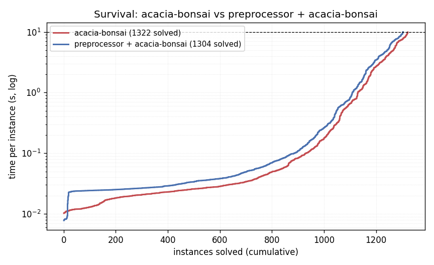

# acacia-bonsai vs preprocessor + acacia-bonsai

Generated benchmark snapshot. This file records maintained head-to-head
measurements only; regenerate it with `scripts/benchgraph.py` before relying on
the numbers.

Regenerate the report:

```sh
scripts/benchgraph.py \
    --corpus ../benchmarks/tlsf \
    --tlsfcompose build-oxidd/tlsfcompose \
    --solver ../acacia-bonsai/build_best_decomp_mona/src/acacia-bonsai \
    --out BENCHGRAPH.md \
    --data benchgraph.tsv \
    --timeout 10 --mem-gb 6
```

<!-- BENCHGRAPH:PREPROCESSOR START (generated by scripts/benchgraph.py) -->
## acacia-bonsai vs preprocessor + acacia-bonsai (`scripts/benchgraph.py`)
Head-to-head synthesis: standalone **acacia-bonsai** vs the **preprocessor** (`--split` decomposition + one persistent OxiDD residual-solving phase + external residual merge). Trusted exact/UNDER controller routes and trusted OVER UNREAL routes finish in process; remaining exact residual clusters go to acacia-bonsai. Each (engine, spec) pair gets the same timeout. Regenerate with `scripts/benchgraph.py` (or `--from-data benchgraph.tsv` to re-render).

### Run: 2026-06-26 22:23 UTC · commit `cc1ff25`
- Corpus `../benchmarks/tlsf` (2545 specs); timeout **10s**, 6 GB/run (systemd cgroup hard cap), sequential.
- acacia-bonsai: `tlsf2tlsf --basic` + `tlsf2ltl --format ltlxba` + `acacia-bonsai -F ... -i ... -o ... -s ...`
- preprocessor + acacia-bonsai: `scripts/solve.sh --backend acacia --solver ...`
- Specs completed without an external residual solver: **454/2545 = 17.8%**.

### Solved within timeout
| engine | solved | only this engine |
|---|--:|--:|
| acacia-bonsai | 1322/2545 | 60 |
| preprocessor + acacia-bonsai | 1304/2545 | 42 |

- Both: 1262; neither: 1181. **Net gain from the preprocessor: -18** (42 won, 60 lost).
- Preprocessor-only solves by family: selection-ltl-2025×36, extracted-benchmarks×2, specs×1, parametric×1, parametric×1, Lights2_f1477cc5×1.

### Speed (both produced a controller)
- 760 specs both SOLVED. **Speedup `acacia/preproc`: median ×0.84, geomean ×0.69** (faster 142, slower 618); aggregate wall ×0.86.


<!-- BENCHGRAPH:PREPROCESSOR END -->
