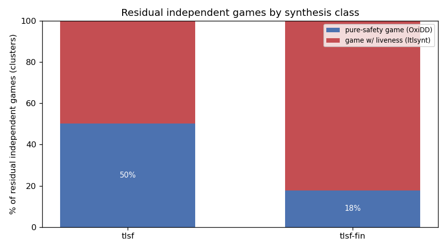
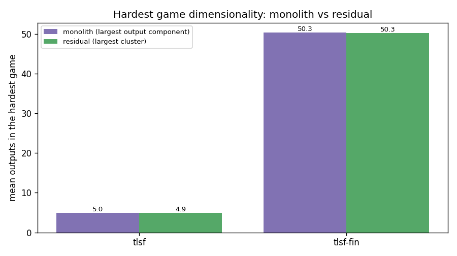
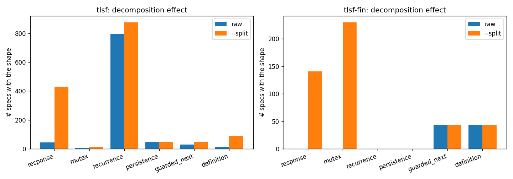

# SYNTCOMP form / template-shape statistics

Aggregate structural statistics of the [SYNTCOMP](https://github.com/SYNTCOMP/benchmarks)
benchmark corpus, computed with `tlsfbenchgraph`. Two sets:

- **`tlsf`** — real-time / infinite-word benchmarks (2545 specs).
- **`tlsf-fin`** — finite-word (LTLf) benchmarks (2487 specs).

Every spec in both sets parses, expands and is analysed (0 failures). Numbers
come from the synthesis-graph layer (`tlsfgraph` cover + recognizers,
`tlsftemplates` certification, `tlsfwl` WL refinement). They are *syntactic* —
a constraint is counted under a shape only if it matches that shape's exact
pattern, so per-shape counts are **lower bounds**.

**Primary tables use `--split`** (constraint decomposition): each section
formula is split into its top-level `&&` conjuncts (distributing `G`/`X` over
`&&` along the spine — equivalence-preserving), so structure conjoined into one
clause is visible to the recognizers. A dedicated section below quantifies the
effect of decomposition (it is large).

Regenerate everything (plots + the tables below):

```sh
ninja -C build
python3 scripts/benchgraph_plots.py \
    --benchgraph build/tlsfbenchgraph --out docs/benchgraph --wl 6 \
    /path/to/benchmarks/tlsf:tlsf \
    /path/to/benchmarks/tlsf-fin:tlsf-fin
```

(The script needs `matplotlib`; it runs `tlsfbenchgraph` itself — once per
corpus *with* and *without* `--split` — writes the PNGs under
`docs/benchgraph/`, and prints these markdown tables. TSVs go to a temp dir and
are discarded.)

---

## Corpus overview (decomposed)

| corpus | specs | parsed | constraints (med/mean/max) | inputs (med) | outputs (med) |
|---|--:|--:|---|--:|--:|
| `tlsf` | 2545 | 2545 | 13 / 35.7 / 5154 | 8 | 3 |
| `tlsf-fin` | 2487 | 2487 | 7 / 13.8 / 162 | 12 | 10 |


`tlsf` has a small-but-long-tailed size profile; `tlsf-fin` specs are written as
one or a few large conjunctive formulas (see the decomposition blow-up below).

## Template-shape prevalence (decomposed)

| corpus | response | mutex | recurrence | persistence | global recurrence | guarded_next | definition |
|---|--:|--:|--:|--:|--:|--:|--:|
| `tlsf` | 431 (2551) | 12 (14) | 876 (1882) | 46 (54) | 4 (4) | 48 (129) | 92 (331) |
| `tlsf-fin` | 141 (544) | 230 (655) | 0 (0) | 0 (0) | 0 (0) | 292 (601) | 43 (43) |

_Cells: number of specs exhibiting the shape, and (total candidate count)._


- **`tlsf` is recurrence-dominated** — a `GF` recurrence in **876 / 2545 (≈34 %)**
  specs — but once conjunctions are split, **response** is the second most
  common shape (431 specs), and **definition** (92), **guarded-next** (48), and
  the rare deterministic-Buchi **global recurrence** shape (4) are non-trivial.
- **`tlsf-fin` still has no recurrence/persistence** (`GF`/`FG` are meaningless
  on finite traces) but, after decomposition, it is clearly **arbitration- and
  guarded-next-shaped**: **mutex in 230 specs, response in 141, and
  guarded-next in 292** — much of this is invisible without splitting (see next
  section).

## Safety / liveness and template-solvable coverage (decomposed)

| corpus | solved blocks | certified | specs ≥1 solved | specs fully solved | constraints eliminated | outputs owned |
|---|--:|--:|--:|--:|--:|--:|
| `tlsf` | 502 | 14 | 202 | 2 | 0.4 % (385/90855) | 2.2 % (318/14463) |
| `tlsf-fin` | 305 | 426 | 89 | 0 | 0.6 % (219/34352) | 0.2 % (219/132149) |

_"constraints eliminated" / "outputs owned" are the **residual reduction**:
constraints discharged and outputs determined by a sound composable controller
(`tlsfresidual` / `tlsftemplates --check`)._


The certified template library spans the Manna–Pnueli safety–progress hierarchy
([spot's classes](https://spot.lre.epita.fr/hierarchy.html)): **safety**
(definition / delayed-definition / guarded-next / reaction / mutex / a general
stateless **safety-invariant** `G(B)`), **guarantee** (`F o`), **persistence**
(`FG o`) and **recurrence** (global recurrence switch / response / round-robin /
arbiter). The controllers are **composable**: combinational decoders (`o:=θ`,
`o:=true`, `o:=⋁guards`, and the invariant Skolem `o:=¬B[o:=⊥]`) are
*eliminated from the residual by substitution*, deterministic-Buchi switches
emit a one-bit local controller, and responses on a shared grant are merged into
one **fair server** rather than the monopolizing `o:=true`.

The stateless safety-invariant `G(B)` (B temporal-free) is solved by a
memoryless Skolem controller when its outputs are free and `∀inputs∃outputs.B`
(a bounded propositional check); single- and multi-output. It is the most
general safety template, but on the corpus it barely moves the needle (`tlsf`
constraints eliminated 326→383 before the later global-recurrence addition,
`tlsf-fin` +0): almost all real safety either couples outputs read elsewhere or
is **stateful** (mentions `X`), which a *stateless* invariant cannot claim.
Confirms that the coverage lever is genuine **safety-game solving**, not more
syntactic templates.

## Composable certification & residual reduction (`tlsfresidual`)

Each block is certified *locally*; "specs with ≥1 solved block" (202 / 89) is a
floor, not a solved-spec count. The real measure is how much of the problem a
**sound whole-spec decomposition** removes before handing off to a synthesizer:

| corpus | fully solved | constraints eliminated | outputs owned | specs with a residual conflict |
|---|--:|--:|--:|--:|
| `tlsf` | **2** | 0.4 % | 2.2 % | 48 |
| `tlsf-fin` | **0** | 0.6 % | 0.2 % | 43 |

Two honest findings:

1. **Composability was the soundness fix, not a coverage fix.** Substitution
   eliminates every combinational decoder *exactly* (an output merely *read*
   elsewhere is rewritten, not ejected), and fair-server merging turns
   same-resource requests into one block instead of a self-collision. This
   removed the M6a ejection pathology — `tlsf` composition conflicts dropped
   **113 → 48**, and those that remain are *genuine* (decoder cycles, real value
   clashes such as `G(o<->a) ∧ G!o`, which surface as an unrealizable residual).
2. **But the headline barely moves: ~0.4–0.6 % of constraints are eliminated and
   only 2 specs are fully solved.** The new deterministic-Buchi switch handles
   the two `ltl2dba22` copies; real specs are still dominated by plain safety
   constraints no template matches, plus `ASSUME` assumptions that always belong
   to the residual. Templates discharge the few cleanly decoupled obligations
   (mostly definitions); the bulk (~99 %) is the residual.

So the answer to "what raises the statistics" is: **composition was necessary
but not sufficient**, and **more syntactic templates are not the main lever**.
The general stateless safety-invariant added essentially nothing, because real
safety is stateful (`X`) or output-coupled.  The useful lever is a real backend
for residual games: AbsSynthe now covers the non-finite safety slice, including
strict safety wrappers of the form `S W !A`, while GR(1)-style liveness
residuals still need a separate path.

## Residual complexity (monolith → residual)

"Fully solved" is a binary that hides most of the value. Reactive synthesis cost
is ~exponential in the number of controllable **outputs** and in **operator
class** (parity ⊐ safety ⊐ solved), so a spec we never fully close can still be
exponentially cheaper after decomposition. `tlsfbenchgraph` now measures, per
spec, the **residual** the backends still face — every accepted SOLVED block
removed (so `fully_solved` ⇔ empty residual), the rest substituted and
partitioned into output-disjoint clusters (one independent game each) — and
reports its size, cluster count, hardest-cluster output count, and per-cluster
safety/liveness class with the same classifier as the monolith columns.





| corpus | fully solved | specs factoring ≥2 clusters | residual clusters (safety→AbsSynthe / liveness→ltlsynt) | hardest game outs monolith→residual (mean) | residual size / monolith |
|---|--:|--:|--:|--:|--:|
| `tlsf` | 2 (0%) | 746 (29%) | 2004 (43%) / 2655 (57%) | 5.0→4.9 | 76.7% (7388596/9631686) |
| `tlsf-fin` | 0 (0%) | 1422 (57%) | 1455 (21%) / 5533 (79%) | 50.3→50.3 | 100.1% (21774881/21748136) |

Three findings, and they reframe where the leverage is:

1. **Templates barely shrink the hardest game.** The largest residual cluster has
   essentially the same output count as the monolith's largest output component
   (`tlsf` 5.0→4.9, `tlsf-fin` 50.3→50.3): the big multi-output transition cores
   `G(..→X(o1∨..∨o6))` survive untouched. Template ownership (~2 % of outputs) is
   not the dimensionality lever.
2. **Clustering is the lever.** **29 % of `tlsf` and 57 % of `tlsf-fin` specs
   factor into ≥2 output-disjoint independent games.** Because cost is
   exponential in a single game's outputs, solving `max(cluster)` instead of the
   whole spec — `Σ exp(out_i)` rather than `exp(Σ out_i)` — is a real (often
   exponential) reduction that lands even at a ~0 % template solve rate. The
   residual is also smaller as a formula on `tlsf` (76.7 % of the monolith).
3. **Liveness is sparse per clause but pervasive per spec.** ~99 % of residual
   *conjuncts* are safety, yet most *specs* still carry one `GF`/`F` clause, so a
   whole spec can rarely be handed to AbsSynthe as one game. Clustering isolates
   that tail: **43 % of `tlsf` (21 % of `tlsf-fin`) residual independent games are
   pure-safety, AbsSynthe-eligible**; only the liveness clusters need `ltlsynt`.
   The path to a higher solved fraction is therefore *finer clustering that peels
   each safety game off the liveness tail*, not more closed-form templates.

**Follow-up — finer clustering (per-cluster relevant-assumption scoping).** Each
cluster now attaches only the assumptions relevant to it (a transitive cone of
influence over signals) and drops liveness assumptions from safety-only clusters
(a liveness assumption can never prevent a finite-time safety violation, so it is
irrelevant to a safety guarantee; `src/residual.c` `residual_build_cluster`). This
is sound — synthesizing against a subset `Eᵢ ⊆ E` of the assumptions still yields
a controller valid under the full `E`. It cleanly de-contaminates the case a
global liveness assumption inflates an otherwise-safety cluster (`cluster_assume`,
`cluster_prune`) and leans cluster formulas. **But it does not move the SYNTCOMP
needle**: the 43 %/21 % safety-cluster split is unchanged, because the corpus
liveness clusters are **guarantee-driven** (responses `G(req→F grant)`, `U`-shaped
amba obligations), not assumption-contaminated. The completeness rule correctly
*retains* each cluster's fairness (e.g. `G F HREADY` stays on the `READY2`
response game). The genuine lever for those clusters is a **GR(1)/Büchi backend**;
finer clustering is its enabler, since each GR(1) game now carries only its
relevant fairness assumptions.

## Self-contained AIGER synthesis without `ltlsynt`

`tlsfcompose --aiger` routes eligible non-finite safety residual clusters to
AbsSynthe.  The measurements below deliberately pass `--ltlsynt /bin/false`, so
every successful run is handled by certified templates plus AbsSynthe only.

| corpus | full controllers | unrealizable | timeout | still needs `ltlsynt` / liveness backend |
|---|--:|--:|--:|--:|
| `tlsf` | 125 / 2545 (4.9 %) | 7 | 1 | 2412 |
| `tlsf-fin` | 0 / 2487 (0.0 %) | 0 | 0 | 2487 |

For `tlsf`, `tlsfcompose --split` produces 318 certified/local controller
outputs and 4659 residual clusters.  The fake AbsSynthe backend says 131 whole
specs are syntactically eligible without `ltlsynt`, covering 1483 residual
clusters.  Real AbsSynthe, run only on those eligible specs with a 10s/spec
timeout, emits controllers for 123 specs; those successful specs account for
1439 residual clusters.  In composition-unit terms, coverage rises from
**318 / 4977 (6.4 %)** template-owned units to **1757 / 4977 (35.3 %)**
units with real AbsSynthe controllers.

### Bounded-liveness reduction (recurrence/response without `ltlsynt`)

The liveness clusters above are guarantee-driven (recurrence `G F g`, responses
`G(req→F grant)`). For the **fairness-free** ones, `tlsfcompose --aiger` bounds
the guarantee liveness at *positive polarity only* — sound, a strictly stronger
obligation — and solves the resulting **safety** game with the *existing*
AbsSynthe (no `ltlsynt`, no AbsSynthe changes; `--bound N`, default 4):
`F x → x|Xx|..|X^k x`; `a U b → ⋁_i (⋀_{j<i}X^j a ∧ X^i b)`; and `a W b`, `a R b`,
`a M b` by the sound strengthening `⟸ a U b` / `⟸ b U (a∧b)`. A fairness
assumption sits at negative polarity, is left intact, fails the safety
eligibility check, and stays on `ltlsynt`; a bounded miss falls back, never a
false failure.

On the full `tlsf` corpus (`--split`, fake AbsSynthe, `--bound 4`), whole-spec
eligibility without `ltlsynt` rises **131 → 266** (`F` alone reached 229; `U`,
`W`, `R`, `M` add +37). On a 40-spec sample of the newly-eligible specs, **real**
AbsSynthe emits full controllers for **38 (95 %)** at `k=4`. Soundness is
machine-checked: the `k`-bounded controller satisfies the **unbounded** spec
(`scripts/verify_aiger_ltl.py`: `bounded_resp`, `bounded_until`, `bounded_wuntil`,
`cluster_prune`).

A self-contained **bounded GR(1)** path follows: a cluster
`(SafetyAssume ∧ G F a) → (SafetyGua ∧ ⋀ Justice)` becomes a safety game by giving
each justice goal a counter **gated on the fairness signal `a`** ("met within `k`
occurrences of `a`", sound because it never bounds the env's absolute timing).
It solves and machine-verifies the clean GR(1) shape (`gr1_spec`, `gr1_response`).

**Plateau (honest).** Bounded reduction stops here: `F` +98 (→229), `U`/`W`/`R`/`M`
+37 (→266), bounded GR(1) **+0** (→266). The GR(1) encoder is correct but its
clean shape — single fairness, `F`-shaped responses, no initial conditions —
**does not occur in SYNTCOMP**: the real GR(1) clusters are multi-fairness,
`U`-shaped (amba `!READY U (HREADY ∧ …)`), and carry initial conditions
(`!DECIDE`). Shape-matched bounded reduction has hit its ceiling; the messy GR(1)
tail needs a *complete* GR(1) solver with no shape restrictions — `ltlsynt` (the
fallback) or the planned AbsSynthe GR(1) fixpoint extension (`aig.cpp:83-84`
already parses, then ignores, justice/fairness). Pure-safety-release `W`/`R`
(~149) remain a smaller separate prize for an exact "released"-latch monitor.

The remaining gap is not a safety-backend issue.  The local `bench/specs` rerun
illustrates the shape: `small_Lights2_f1477cc5_2.tlsf` is solved by the safety
backend and `small_ltl2dba22.tlsf` by the global-recurrence template.  The four
robot benchmarks now advance past their strict-safety cluster with AbsSynthe,
but still stop at a GR(1) liveness cluster when `ltlsynt` is disabled. Raising
the no-`ltlsynt` full-spec count further needs GR(1)-style handling, not
another stateless template.

## Effect of constraint decomposition (`--split`)

| corpus | constraints (total) | response | mutex | recurrence | persistence | global recurrence | guarded_next | definition |
|---|--:|--:|--:|--:|--:|--:|--:|--:|
| `tlsf` | 33513 → 90855 | 44→431 | 4→12 | 796→876 | 46→46 | 4→4 | 30→48 | 16→92 |
| `tlsf-fin` | 3051 → 34352 | 0→141 | 0→230 | 0→0 | 0→0 | 0→0 | 43→292 | 43→43 |

_(specs exhibiting the shape: raw → decomposed)_



This is the headline: most specs write several obligations as **one conjunctive
clause**, so whole-formula matching badly under-counts structure. Splitting
(equivalence-preserving) multiplies the visible constraints (tlsf ≈2.7×,
tlsf-fin ≈11×) and uncovers shapes that were entirely hidden —
**`tlsf-fin` mutex 0 → 230, response 0 → 141, guarded-next 43 → 292**;
**`tlsf` response 44 → 431**.
Counts that don't reference `&&`-conjoined siblings (recurrence, persistence)
are essentially unchanged, as expected.

## Weisfeiler-Lehman stabilisation depth (decomposed)

| corpus | WL stabilisation depth (med/mean/max) |
|---|---|
| `tlsf` | 3 / 2.7 / 6 |
| `tlsf-fin` | 3 / 3.0 / 6 |


Even decomposed, the graphs are **shallow**: WL refinement reaches a fixed point
in a median of 3 rounds (≤6 anywhere), so low-depth fingerprints suffice for
clustering/retrieval.

## Normalisation (formula size under `--strong-simplify`)


`--strong-simplify` is a *normal form*, not a minimiser (it eliminates `W`/`R`
and applies NNF): on `tlsf` it tends to grow formulas (median ×1.14), on
`tlsf-fin` it is roughly neutral (median ×0.99).

---

## Key takeaways

1. **Most obligations are conjoined into one clause.** Whole-formula matching
   under-counts; decomposition multiplies visible constraints (≈2.7× / ≈11×)
   and is what makes the shape statistics meaningful.
2. **`tlsf` is recurrence-dominated** (~34 % of specs) with responses pervasive
   once split (431 specs).
3. **`tlsf-fin` is arbitration- and guarded-next-shaped, hidden in single
   formulas** — mutex (230), response (141), and guarded-next (292) are exposed
   after `--split`; no recurrence at all.
4. **Decomposition ~3.7×'s template-solvable `tlsf` coverage** (55 → 202 specs);
   the expanded library (free-liveness, reaction, delayed-def, fair arbiter)
   *solves* `tlsf-fin` arbitration (137 → 305 blocks, 51 → 89 specs).
5. **Composable certification is sound but template coverage is bounded.** Substitution
   eliminates combinational decoders exactly and fair servers merge shared
   requests, removing the old ejection pathology (`tlsf` conflicts 113 → 48).
   Template-only composition now fully solves **2** specs and only
   **~0.4–0.6 % of constraints** are eliminated.  With AbsSynthe, however,
   `tlsfcompose --aiger --ltlsynt /bin/false` now emits real full controllers
   for **125 / 2545** `tlsf` specs and classifies 7 more as unrealizable.
   Remaining no-`ltlsynt` coverage needs liveness / GR(1)-style solving.
6. **Structure is shallow** (WL depth ≤6) and **`--strong-simplify` can grow**
   formulas (it normalises, it does not shrink).
7. **Decomposition lowers complexity through clustering, not template
   ownership.** Templates barely move the hardest game (largest residual cluster
   ≈ monolith's largest output component), but 29 % of `tlsf` / 57 % of
   `tlsf-fin` specs factor into ≥2 independent games, and 43 % / 21 % of those
   games are pure-safety (AbsSynthe-eligible). The lever for a higher solved
   fraction is finer clustering that peels each safety game off the per-spec
   liveness tail.

## Caveats

- Recognizers are *syntactic*; per-shape numbers are lower bounds even after
  decomposition.
- `--split` distributes `G`/`X` over `&&` only along the spine (never inside
  `F`/`U`/…), so it is equivalence-preserving and does not perturb
  recurrence/persistence counts.
- Combinational outputs (definition/reaction/reachability/persistence) are
  **eliminated by substitution** (`o:=value` rewritten into the residual), so an
  output merely *read* elsewhere costs nothing; a constraint that genuinely
  *forces* `o` the other way becomes an unrealizable residual (surfaced, not
  mis-certified).
- Liveness-owned outputs (fair servers, registers) have no closed form, so they
  keep a conservative **free-output** rule: they reduce the residual only when
  the output is otherwise unreferenced. This is where coverage is left on the
  table — a shared grant read by other constraints stays in the residual.

<!-- BENCHGRAPH:PREPROCESSOR START (generated by scripts/benchgraph.py) -->
## Preprocessor speed & complexity vs ltlsynt (`scripts/benchgraph.py`)
Is templates+AbsSynthe a FAST preprocessor? Two metrics: residual **complexity**
(what's left after templates+AbsSynthe) and **speed** (our full pipeline vs standalone
`ltlsynt --tlsf` on the whole spec). Goal: carve off safety with AbsSynthe, forward
only the hard liveness residual to ltlsynt, and never be slower or less complete.
Regenerate: `scripts/benchgraph.py --corpus DIR --tlsfcompose … --abssynthe … --ltlsynt …`
(or `--from-data benchgraph.tsv` to re-render this section without re-running).

### Run: 2026-06-13 21:24 UTC · commit `09ae984`
- Corpus: `/home/gperez/GIT-repos/benchmarks/tlsf` (2545 specs)
- Caps: timeout 20s/run, AbsSynthe 6s/cluster, 6 GB RAM, sequential
- Baseline: `ltlsynt --tlsf=SPEC --aiger` (syfco translation, full synthesis)
- Ours: `tlsfcompose --split --aiger --abssynthe … --ltlsynt …`
- Per-spec data: `benchgraph_oxidd.tsv`

### Complexity
- **Self-contained (templates+AbsSynthe, no ltlsynt): 817/2545 = 32.1%** (633 use AbsSynthe).
- **AbsSynthe reach (≥1 cluster): 706/2545 = 27.7%**.
- Residual shape (specs not self-contained), hardest cluster:

  | residual class | specs |
  |---|---|
  | liveness (F/U/GF/Buchi) | 1507 |
  | GR(2+) generalized reactivity | 91 |
  | (none / unrealizable verdict) | 73 |
  | other | 40 |
  | W/R safety not yet handled | 17 |

### Speed (AbsSynthe-contributing specs)
- Timed: 706 specs. Both produced a controller: 246.
- **Both-solved speedup `base/ours`: median ×4.86, geomean ×8.21** (faster: 225, slower: 21).
- Absolute wall on both-solved: **median ours 5 ms vs base 26 ms** (near parity); mean ours 24 ms vs base 776 ms (mean skewed by a slow AbsSynthe BDD tail).
- Total wall on both-solved: ours 5.8s vs base 190.8s (**×32.88** aggregate).
- Ours solves where **base times out** (≥20s): 153 clear wins — selection-ltl-2025×83, sweap×66, specs×4.

### Completeness vs ltlsynt
- **ltlsynt produced a controller but we did not: 8** — the honest deficit (we are *less complete* on these). Breakdown: 8 we wrongly call **UNREALIZABLE**, 0 backend **FAILED**, 0 **timed out**.
- The false-UNREALs are dominated by selection-ltl-2025×4, tsl_paper×4 — output-free assumption clusters synthesised standalone (TASKS.md gap #2).

### Verdict
On the **median** AbsSynthe-contributing spec where both engines synthesize, tlsf-tools is at **rough parity** (5 ms vs 26 ms) — the abstraction is the fixed cost of spawning AbsSynthe (process + CUDD init) on specs ltlsynt already does in milliseconds. In **aggregate we are ×32.88 faster** than ltlsynt. The genuine value is the **153 specs ltlsynt cannot synthesize in 20s that we do** (GR(1) `amba_gr`, large decomposed safety). The completeness blocker is **8 specs ltlsynt solves that we don't** — now dominated by **8 false-UNREALs** from output-free assumption clusters (TASKS.md gap #2), not parse bugs.
<!-- BENCHGRAPH:PREPROCESSOR END -->
